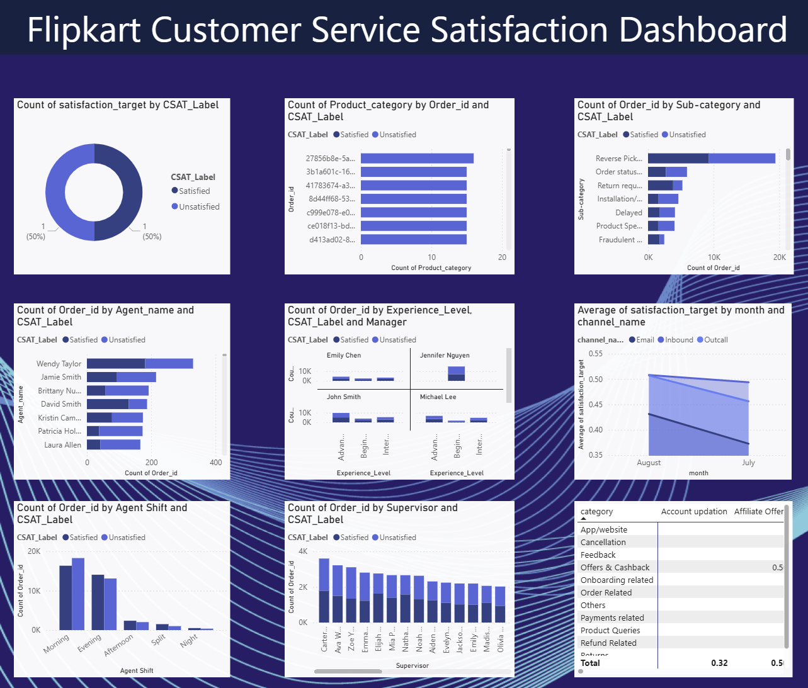
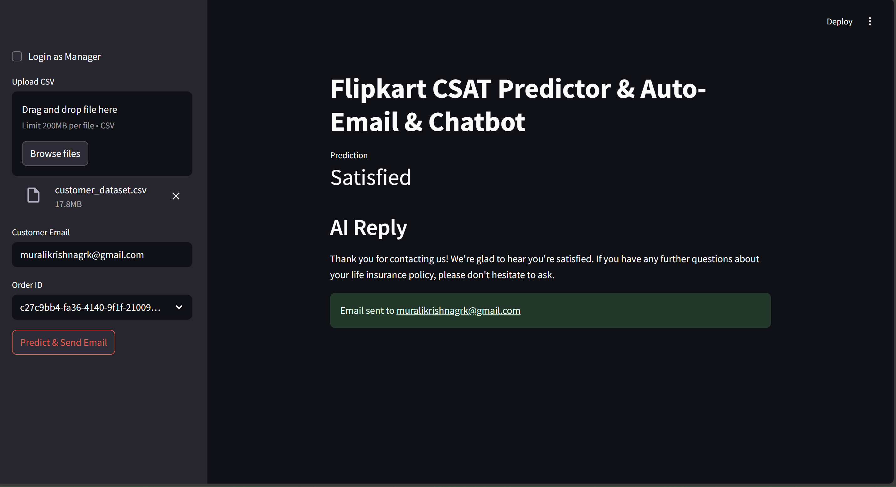
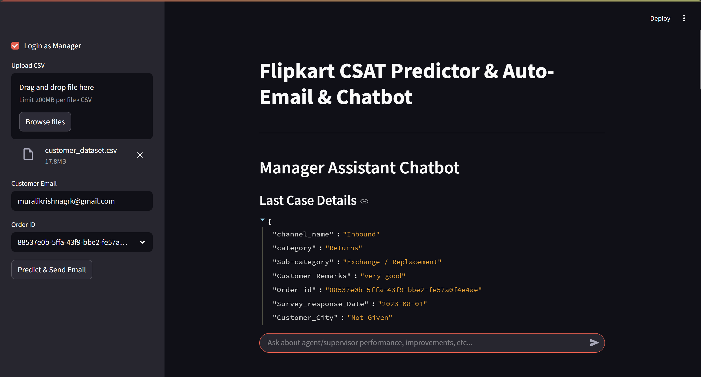
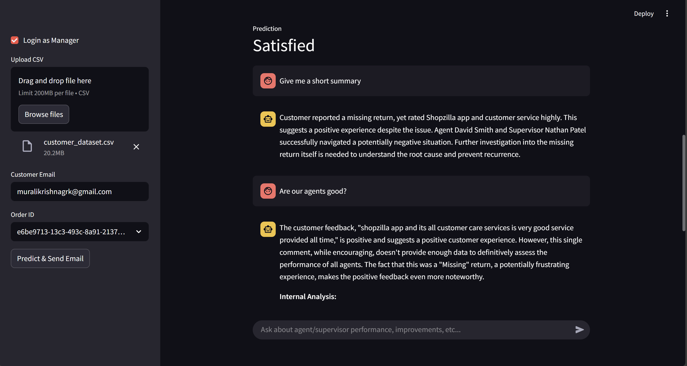

# 🤖 FlipCSAT: AI-Powered Customer Satisfaction Intelligence

## 📌 Overview

This end-to-end machine learning project predicts customer satisfaction outcomes from support interactions and empowers Flipkart’s managers with actionable insights. It combines data preprocessing, model training, model evaluation, Streamlit app deployment, and Gemini-powered generative responses.

> 🔍 ML + GenAI + Deployment + BI

---

## 🧠 Problem Statement

Customer satisfaction (CSAT) is critical for Flipkart's support team. This project builds a solution to:
- Predict if a customer is satisfied or unsatisfied after a support case
- Auto-generate a polite, personalized response using Gemini
- Assist managers via an internal chatbot to analyze agent/supervisor performance

---

## ✅ Features

- 🧹 Cleaned & transformed customer support data
- 🧠 Trained 3 ML models (RandomForest, XGBoost, LightGBM)
- ⚖️ Handled class imbalance
- 🏆 XGBoost selected with **94% test accuracy**
- 🔄 Custom `ColumnTransformer` with:
  - TF-IDF on text
  - OneHot + Ordinal encoding
  - StandardScaler on numerics
- 💬 AI response generation using Gemini (Google Generative AI)
- 📩 Email automation via SMTP to contact customers
- 🔒 Manager-only assistant chatbot (Streamlit + Gemini)
- 📊 Power BI dashboard for team-wide insight

---

## 🚀 Model Pipeline

- Trained on balanced data with `satisfaction_target` as binary label
- Preprocessing handled with:
  - `TfidfVectorizer` on `Customer Remarks`
  - `OneHotEncoder` on low-cardinality features
  - `OrdinalEncoder` on high-cardinality features
  - `StandardScaler` on numerical features

Final model:
```python
XGBClassifier(
    objective='binary:logistic',
    max_depth=20,
    learning_rate=0.05,
    n_estimators=100,
    subsample=0.8,
    colsample_bytree=0.8,
    eval_metric='logloss',
    early_stopping_rounds=50,
    random_state=42
)
```
## 📊 Power BI Dashboard (External)

The Power BI dashboard provides interactive visual analytics to support decision-making by Flipkart managers and analysts.



## 💻 Streamlit App Features

The deployed web application allows real-time prediction, AI-generated communication, and managerial analysis — all powered by Machine Learning and Google Gemini (GenAI).

### Key Functionalities:

- 📁 **CSV Upload or Default Dataset**  
  Easily test the app using your own CSV file or the default dataset provided.

- 🔍 **CSAT Prediction for Individual Orders**  
  Select an Order ID and get an instant prediction: Satisfied or Unsatisfied.

- 🤖 **Gemini-Powered Customer Reply Generation**  
  Automatically crafts a polite, personalized response based on prediction and order details using **Google Gemini**.

- 📩 **Email Automation**  
  Sends the generated reply directly to the customer’s email using SMTP integration.

- 🔒 **Manager-Only Assistant Chatbot (Gemini-Powered)**  
  An internal chatbot powered by **Google Gemini**, designed for Flipkart managers to:
  - Analyze specific support cases
  - Ask about agent or supervisor performance
  - Get improvement suggestions like:
    - "Why did this case fail?"
    - "How can this supervisor improve?"
    - "What shift is underperforming?"

## 🧪 Run Locally

To run the project on your local machine:

```bash
pip install -r requirements.txt
streamlit run app.py
```

## 🔐 Streamlit Secrets Configuration

To run the app securely, store your API keys and email credentials in a `.streamlit/secrets.toml` file.

### 🔑 File: `.streamlit/secrets.toml`

```toml
GEMINI_API_KEY = "your_gemini_api_key"

[email]
smtp_server = "smtp.gmail.com"
port = 465
user = "your_email@gmail.com"
password = "your_app_password"
```

### 📸 App Screenshot







